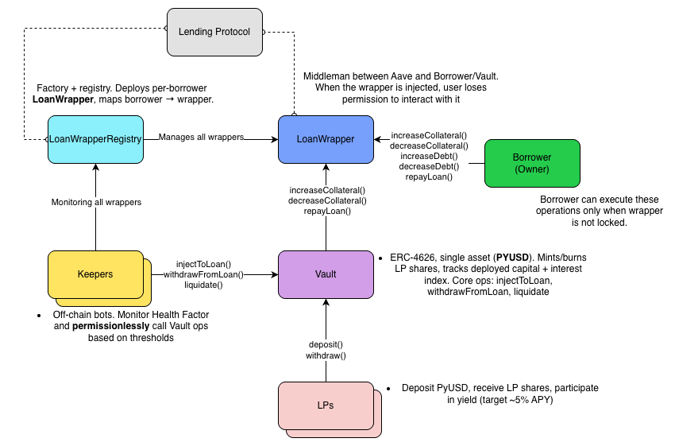

# 🛡️ Cushion - Protection Against Liquidation
### Decentralized protection layer against liquidations in DeFi lending protocols.

## 🧠 Cushion Overview

- 🛡️ **Liquidation Protection**: Cushion **lowers liquidation risk** on Aave by wrapping each user into a per-borrower LoanWrapper and **managing the position for them**.

-	⚡ **Preemptive Defense**: Monitors Health Factor and **tops up collateral before liquidators** (e.g., triggers at a safer threshold) to **keep loans alive**.

-	🧱 **Isolated Accounts**: Every borrower gets a dedicated wrapper for clean risk isolation and simpler repay/adjust flows.

-	🏦 **Earn with Cushion Vault**: deposit **PYUSD** and capture a **~5% APY** to backstop loans.

## 🏗️ Architecture

## 📜 Smart Contracts
### LoanWrapperRegistry
- Wrapping new loan, for each borrower deploys new LoanWrapper, sends borrower's collateral on lending protocol and borrowing assets to borrower's account.

### LoanWrapper
- Middle-man between lending protocol and borrower/vault. Provides all the functions to borrower until health factor drops and Keeper injects additional collateral. As soon as injected collateral is withdrawn, borrower receives permission to interact with its loan again.
  
### Vault
- Holds PYUSD, mints LP tokens on deposit, and tracks deployed capital + an interest index. 
- LPs earn variable yield from protection fees and interest on injected capital (target ~5% APY, not guaranteed).
- Provides additional collateral for injection when health factor of loan drops below threshold

### Mocks
- We developed many mocks for simulating scenarios where Cushion steps in.
- Mocks included: ERC20, WETH, AAVEPool, PoolAddressesProvider (AAVE), EthOracle and VariableDebtToken

## 📝 License
  - This project is licensed under the MIT License.

## Other Documentations
- [Keepers](docs/keepers.md) (Our own whitelisted 3rd party)
- [Setup](docs/setup.md) (Run Cushion locally)
- [Development Process](docs/developement_process.md) (Our steps during Cushion development)
