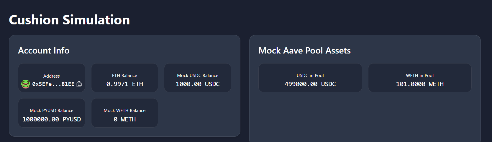
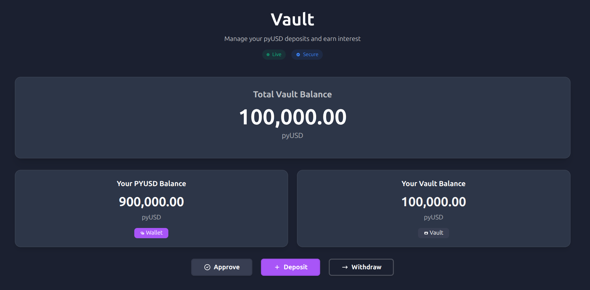
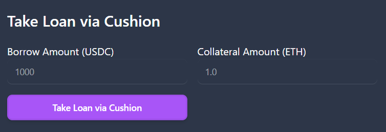
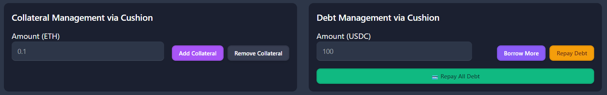
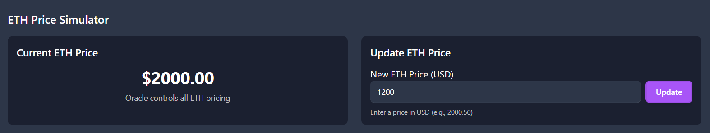
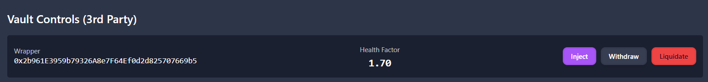

# How to make your own simulation
First you need to be connected on hardhat instead on sepolia.

Second you need to take faucet eth, so you have enough for transactions

You see your wallet balance, make sure you have more than 1ETH 
## Mock Controls

This is where you can control your mock tokens. Mint 1M PyUSD 

## Vault

Here is your vault, you can see how much pyUSD you have available to add into the vault, then the total balance of a vault and how much you have in the vault.

Click approve and put how much money you are gonnna deposit. Then deposit how much money you want.

## Take a loan

Here you take loan. Put how much collateral you want, and how much USDC you want to borrow. Keep in mind, you can only tak usdc, so the health factor wont be bellow 1.15

After that you will see your loan, how much collateral you have, how much debt you have etc.

## Removing collateral / paying debt

Here you can pay your debt or increase/decrease collateral

## ETH Mock price

Here you can mock the eth price, on the left you see current MockETH price, on the right you can update ETH price

## Control vaults 

If you dont have keepers on, you can manually inject/withdraw or liquidate loan on your own
